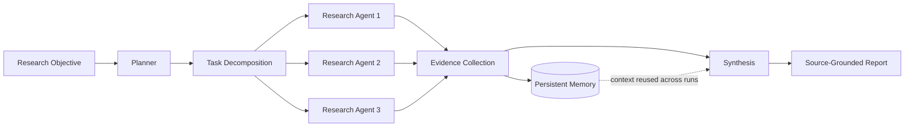

# Research Swarm

> **Multi-agent AI research system** — a natural-language objective becomes a source-grounded report through specialized agents, parallel execution, and persistent memory.

**Live demo** → [research-swarm-omega.vercel.app](https://research-swarm-omega.vercel.app/)

## Why it exists

Research tasks (market scans, literature reviews, technical comparisons) are slow and shallow when done by hand. Research Swarm turns an objective like *"Compare approaches to persistent memory in AI agents"* into a coordinated research run: agents plan, delegate, gather, and synthesize — with every claim traceable to a source.

## Architecture



## Key features

- **Task decomposition** — an objective is broken into research subtasks and assigned to specialized agents.
- **Parallel agent execution** — independent research runs in parallel instead of serially.
- **Persistent memory** — context carries across runs, so a follow-up question reuses prior findings instead of re-searching.
- **Source grounding** — every synthesized claim maps to a retrieved source; nothing is free-generated.
- **Result synthesis** — a final report merges agent outputs with citations.

## Measured results

| Metric | Value |
| --- | --- |
| Specialized agents | 3 |
| Persistent memory | cross-run context retention |
| Source grounding | every claim cited |
| Execution | parallel research path |

## Tech stack

- Python
- LLM APIs (OpenAI-compatible routing)
- Agent orchestration framework (LangGraph / custom graph)

## Getting started

```bash
git clone https://github.com/chandu954/Research-Swarm
cd Research-Swarm
pip install -r requirements.txt
cp .env.example .env   # add your API keys
python -m swarm.cli --objective "your research objective"
```

## Roadmap

- [ ] Eval harness (RAGAS) for synthesis quality
- [ ] Cost tracking per run
- [ ] Streaming report output